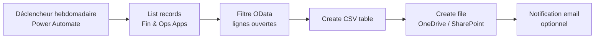

# Exportation hebdomadaire — Lignes de commande vente en cours (D365 F&O → CSV via Power Automate)

## Objectif

Mettre en place, pour **un utilisateur donné**, une exportation **automatique chaque semaine** de la liste standard **« Lignes de commande vente en cours »** (*Open sales order lines*) depuis Dynamics 365 Finance & Operations vers un **fichier CSV**.

Chemin menu D365 F&O : **Ventes et marketing → Commandes client → Commandes ouvertes → Lignes de commande vente en cours**.

---

## Vue d'ensemble de l'architecture



| Composant | Rôle |
|-----------|------|
| **Connecteur Fin & Ops Apps (Dynamics 365)** | Lecture des entités de données OData exposées par F&O |
| **Entité Sales order lines V2** (`SalesOrderLines`) | Source de données alignée sur les lignes de commande client |
| **Filtre OData** | Reproduit la logique « lignes ouvertes » de l'écran standard |
| **Create CSV table** | Conversion des enregistrements en contenu CSV |
| **Create file** | Enregistrement du fichier dans l'espace de l'utilisateur |

---

## Prérequis

### Licences et accès

| Élément | Exigence |
|---------|----------|
| Power Automate | Licence incluse dans Microsoft 365 ou Power Automate per user |
| D365 F&O | Accès lecture aux lignes de commande client pour l'utilisateur cible |
| Connecteur | **Fin & Ops Apps (Dynamics 365)** activé dans l'environnement Power Platform |
| Entité OData | **Sales order lines V2** publiée et accessible (standard, sans développement) |

### Droits D365 F&O (utilisateur cible)

L'utilisateur doit disposer au minimum des privilèges permettant d'ouvrir l'écran **Lignes de commande vente en cours** et de consulter les données exportées (client, article, quantités, montants, etc.).

### Connexion Power Automate

Créer la connexion **Fin & Ops Apps (Dynamics 365)** avec les identifiants de l'utilisateur cible (**connexion « utilisateur final »**), afin que l'export respecte les droits de sécurité D365 de cet utilisateur.

---

## Étape 1 — Vérifier l'entité de données dans D365 F&O

1. Ouvrir **Gestion des données** (*Data management*).
2. Rechercher l'entité **Sales order lines V2** (`SalesOrderLineV2Entity`).
3. Vérifier qu'elle est **activée pour OData** (par défaut pour les entités standard).
4. Tester un export manuel vers Excel depuis l'écran **Lignes de commande vente en cours** pour valider les colonnes métier attendues.

> **Note :** Si des colonnes spécifiques de l'écran standard manquent (ex. *Reste à livrer*), étendre l'entité standard via **Chain of Command** plutôt que de créer une entité personnalisée.

---

## Étape 2 — Créer le flux Power Automate

### 2.1 Informations générales

| Propriété | Valeur recommandée |
|-----------|-------------------|
| Nom du flux | `Export hebdo - Lignes commande vente en cours - [Nom utilisateur]` |
| Type | Flux cloud automatisé |
| Propriétaire | Administrateur Power Platform ou responsable IT |
| Connexion Fin & Ops | **Identifiants de l'utilisateur final** |

### 2.2 Déclencheur — Récurrence hebdomadaire

| Paramètre | Exemple |
|-----------|---------|
| Intervalle | `1` |
| Fréquence | `Semaine` |
| Jour | `Lundi` (ou jour souhaité) |
| Heure | `07:00` |
| Fuseau horaire | `(UTC+01:00) Paris` |

### 2.3 Action — Lister les enregistrements (Fin & Ops Apps)

| Paramètre | Valeur |
|-----------|--------|
| Action | **List records** (Fin & Ops Apps) |
| Instance | URL de l'environnement F&O (ex. `https://votre-env.operations.dynamics.com`) |
| Nom de l'entité | `Sales order lines V2` ou `SalesOrderLines` |
| Sélectionner les colonnes | Colonnes nécessaires uniquement (performance) |

**Colonnes suggérées (à adapter) :**

```
SalesOrderNumber, ItemNumber, OrderedSalesQuantity, SalesPrice, LineAmount,
RequestedShippingDate, ConfirmedShippingDate, CustomerAccount, CustomerName,
SalesUnitSymbol, InventoryLotId, DeliveryAddressLocationId
```

**Filtre OData** (reproduit les lignes ouvertes) :

```odata
SalesStatus eq Microsoft.Dynamics.DataEntities.SalesStatus'Backorder' and OrderedSalesQuantity gt 0
```

> L'écran standard « Lignes de commande vente en cours » affiche les lignes de commande client non entièrement livrées. Le statut `Backorder` couvre la majorité des cas. Valider le filtre sur un échantillon de données réelles avant mise en production.

**Filtre par société légale** (si l'utilisateur travaille sur une entité précise) :

```odata
dataAreaId eq 'FRA1'
```

Combiner les filtres avec `and` :

```odata
dataAreaId eq 'FRA1' and SalesStatus eq Microsoft.Dynamics.DataEntities.SalesStatus'Backorder' and OrderedSalesQuantity gt 0
```

**Pagination :** activer **Pagination** dans les paramètres avancés de l'action si le volume dépasse 5 000 lignes.

### 2.4 Action — Créer une table CSV

| Paramètre | Valeur |
|-----------|--------|
| Action | **Create CSV table** |
| De | `value` (sortie de l'action List records) |
| Colonnes | Automatique ou personnalisé selon les colonnes sélectionnées |

**Format personnalisé (séparateur point-virgule, format français) :**

Si le CSV doit utiliser `;` comme séparateur (Excel FR), passer en **Format personnalisé** et construire les lignes via une action **Compose** ou **Select** :

```
concat(
  item()?['SalesOrderNumber'], ';',
  item()?['ItemNumber'], ';',
  string(item()?['OrderedSalesQuantity']), ';',
  string(item()?['LineAmount'])
)
```

### 2.5 Action — Enregistrer le fichier CSV

Choisir **une** destination selon le besoin utilisateur :

#### Option A — OneDrive personnel de l'utilisateur (recommandé pour un seul utilisateur)

| Paramètre | Valeur |
|-----------|--------|
| Action | **Create file** (OneDrive for Business) |
| Dossier | `/Exports/D365FO/` |
| Nom du fichier | `Lignes_commande_vente_en_cours_@{formatDateTime(utcNow(), 'yyyy-MM-dd')}.csv` |
| Contenu du fichier | Sortie de **Create CSV table** |

#### Option B — SharePoint (équipe / dossier partagé)

| Paramètre | Valeur |
|-----------|--------|
| Action | **Create file** (SharePoint) |
| Site | Site de l'équipe commerciale |
| Bibliothèque | Documents partagés |
| Dossier | `/D365FO/Exports/[Nom utilisateur]/` |

#### Option C — Envoi par e-mail

| Paramètre | Valeur |
|-----------|--------|
| Action | **Send an email (V2)** (Office 365 Outlook) |
| À | `utilisateur@entreprise.com` |
| Objet | `Export hebdomadaire - Lignes commande vente en cours - @{formatDateTime(utcNow(), 'dd/MM/yyyy')}` |
| Pièce jointe | Contenu CSV + nom de fichier dynamique |

### 2.6 Action — Notification de succès (optionnel)

Ajouter une action **Send an email** ou **Post message in a chat** (Teams) pour confirmer la réussite ou signaler une erreur via un bloc **Configure run after** → *has failed*.

---

## Étape 3 — Gestion des gros volumes (> 5 000 lignes)

Si le volume est important, préférer l'approche **Data Management Framework (DMF)** :

### Dans D365 F&O

1. **Gestion des données → Exporter**.
2. Créer un **groupe de définition** : `PA_Export_LignesCommandeOuvertes`.
3. Ajouter l'entité **Sales order lines V2** avec un filtre sur les lignes ouvertes.
4. Enregistrer le projet d'export.

### Dans Power Automate

| Étape | Action Fin & Ops |
|-------|------------------|
| 1 | **Export package** — lancer l'export DMF |
| 2 | **Get exported package URL** — récupérer l'URL du fichier ZIP |
| 3 | **Get file content** / **Upload file** — extraire le CSV et le déposer sur OneDrive/SharePoint |

Cette approche est plus robuste pour les exports massifs et garantit la cohérence avec les projets d'export D365.

---

## Étape 4 — Sécurité et périmètre utilisateur

| Bonne pratique | Détail |
|----------------|--------|
| Connexion utilisateur final | Le flux s'exécute avec les droits D365 de l'utilisateur cible |
| Solution dédiée | Placer le flux dans une **solution** Power Platform nommée `D365FO-Exports` |
| Partage limité | Ne partager le flux qu'avec l'utilisateur concerné (lecture seule) |
| Dossier isolé | Un sous-dossier par utilisateur sur SharePoint/OneDrive |
| Journalisation | Activer l'historique des exécutions Power Automate (30 jours) |

---

## Étape 5 — Tests et mise en production

### Checklist de validation

- [ ] Le flux s'exécute manuellement sans erreur
- [ ] Le CSV contient les mêmes lignes que l'écran D365 (échantillon de 20 lignes comparé)
- [ ] Les colonnes et formats (dates, décimales) sont corrects
- [ ] Le fichier est créé au bon emplacement avec le bon nom
- [ ] L'utilisateur reçoit la notification (si configurée)
- [ ] La récurrence hebdomadaire est activée
- [ ] Test de pagination si volume > 1 000 lignes

### Test manuel du filtre OData

Depuis un navigateur (session D365 authentifiée) ou Postman :

```
GET https://[votre-env].operations.dynamics.com/data/SalesOrderLines
  ?$filter=SalesStatus eq Microsoft.Dynamics.DataEntities.SalesStatus'Backorder'
  &$select=SalesOrderNumber,ItemNumber,OrderedSalesQuantity,LineAmount
  &$top=10
```

En-tête requis : `Company: FRA1` (remplacer par la société légale cible).

---

## Dépannage

| Symptôme | Cause probable | Action corrective |
|----------|----------------|-------------------|
| Flux vide (0 ligne) | Filtre OData trop restrictif ou mauvaise société légale | Ajuster le filtre ; vérifier `dataAreaId` |
| Erreur 401/403 | Connexion expirée ou droits insuffisants | Reconnecter Fin & Ops ; vérifier les rôles D365 |
| Timeout | Trop de colonnes ou trop de lignes | Réduire les colonnes ; activer pagination ou passer en DMF |
| CSV illisible dans Excel FR | Séparateur virgule | Utiliser format personnalisé avec `;` |
| Colonnes manquantes | Entité standard incomplète | Étendre `SalesOrderLineV2Entity` via extension X++ |

---

## Récapitulatif des actions Power Automate

```
1. Récurrence (hebdomadaire)
2. List records — Fin & Ops Apps — SalesOrderLines + filtre OData
3. Create CSV table
4. Create file — OneDrive / SharePoint
5. [Optionnel] Send an email — notification
```

---

## Références Microsoft

- [Sales order lines V2 entity](https://learn.microsoft.com/en-us/dynamics365/fin-ops-core/dev-itpro/data-entities/entity-sales-order-lines-v2-salesorderline)
- [Fin & Ops Apps connector](https://learn.microsoft.com/en-us/dynamics365/fin-ops-core/dev-itpro/copilot/tutorial-agent-connector)
- [Filtrage OData D365 F&O](https://learn.microsoft.com/en-us/dynamics365/fin-ops-core/dev-itpro/data-entities/odata-public-entities)
